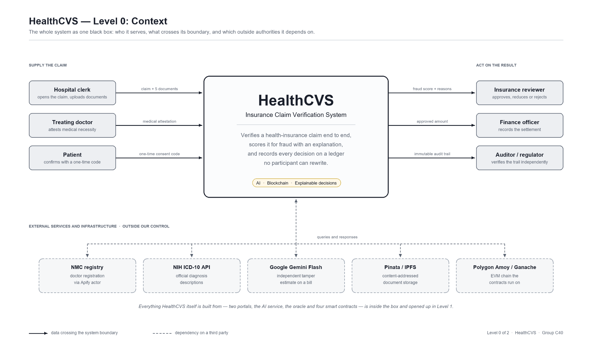
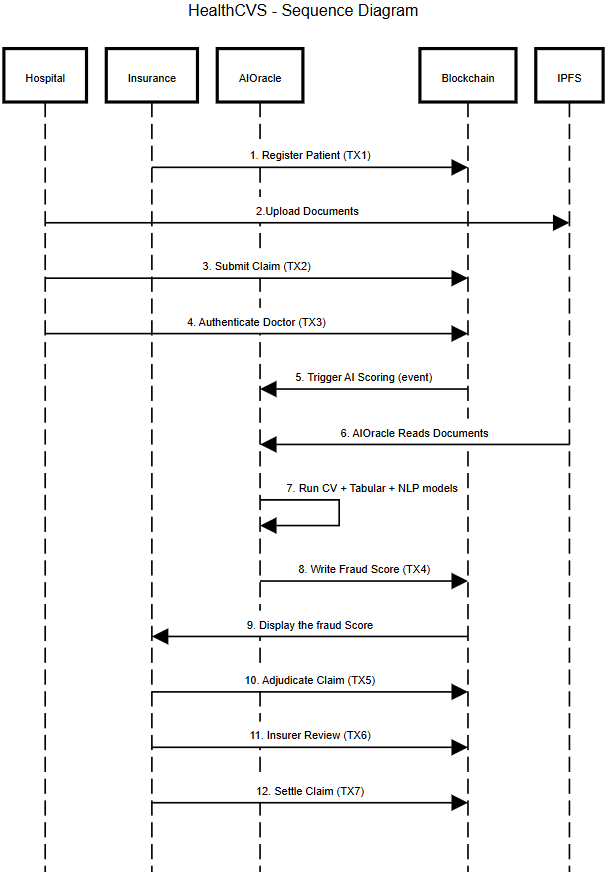
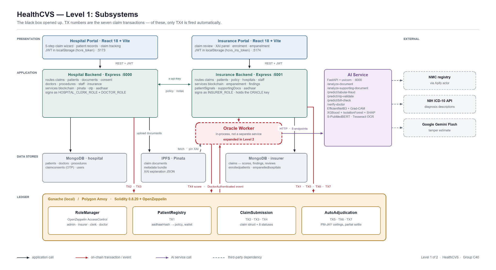
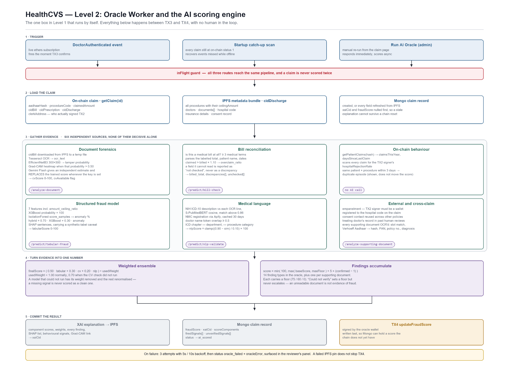
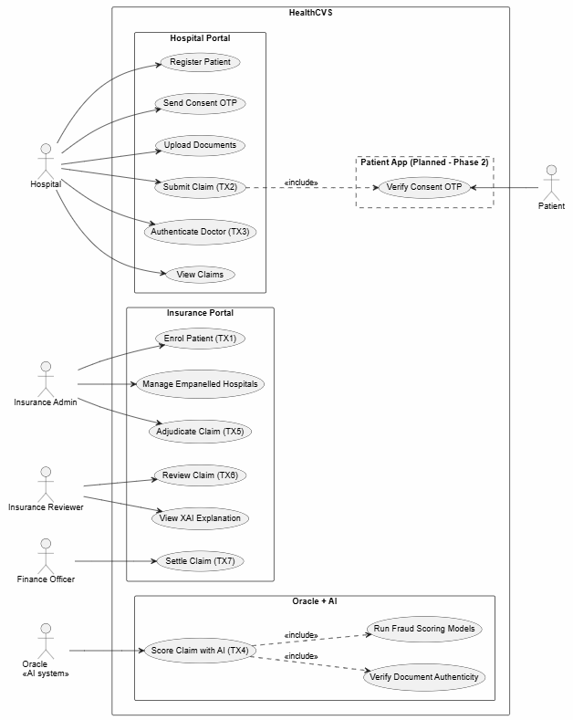
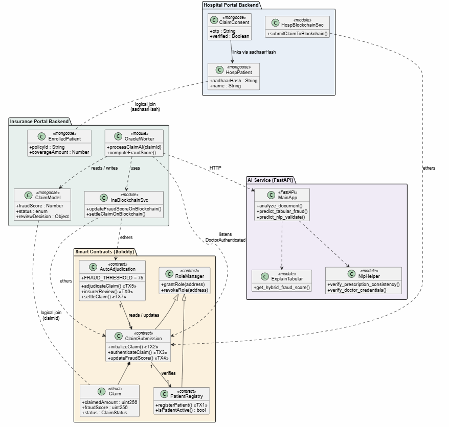

# HealthCVS

**Can a hospital's insurance claim be trusted — and can everyone involved see why?**

HealthCVS is a shared claims network between hospitals and insurers, modelled on NHA's National Health Claims
Exchange. Every claim moves through seven on-chain steps. An AI service scores each claim for fraud and explains its
score, and an insurer's human reviewer makes the final call.

> [!NOTE]
> **Status: working prototype.** It runs end to end on a local Ethereum network (Ganache), with demo policies and
> claims included. It is a final-year engineering project, not a production system — see
> [`docs/gaps_and_limitations.md`](docs/gaps_and_limitations.md) for what it deliberately does not do.

---

## At a glance

|                         |                                                                       |
| ----------------------- | --------------------------------------------------------------------- |
| ⛓️ **7**                | on-chain steps in the life of every claim                             |
| 📜 **4**                | smart contracts: roles, patients, claims, adjudication                |
| 🏥 **2**                | portals: one for hospitals, one for insurers                          |
| 🧾 **5**                | policy types: individual, family floater, corporate, group, government |
| 🤖 **0–100**            | AI fraud score; claims scoring **75 or more** are flagged for review  |
| ✅ **36**               | smart-contract tests                                                  |
| 🎬 **6 policies, 12 claims** | ready-made demo data covering clean, partial and fraudulent cases |

---

## 1. The problem

When a patient is treated, the hospital sends a claim to the insurer, and the insurer has to decide whether to pay.
Three things make that hard:

- **Hospitals and insurers keep separate records.** Neither can easily check the other's version of events.
- **Documents can be forged** — bills, prescriptions, discharge summaries — and a reviewer sees only the paper in front of them.
- **Cover rules are intricate.** Waiting periods, family limits, a shared sum insured and fixed package rates all decide
  how much should be paid, and applying them by hand invites mistakes.

## 2. The idea



1. **A shared ledger** holds the claim's state, so hospital and insurer always see the same facts and no step can be skipped.
2. **The contracts apply the cover rules**, not people: who is insured, for how long, how much of the sum insured is left,
   and what each procedure costs under the rate card.
3. **An AI oracle scores the claim** and stores its explanation next to the documents, so a reviewer sees *why* a claim
   was flagged, not just that it was.

---

## 3. Life of a claim — seven on-chain steps



| TX | Who      | What                                                                                       |
| -- | -------- | ------------------------------------------------------------------------------------------ |
| 1  | Insurer  | Registers a policy and each insured member (only the Aadhaar hash goes on-chain)           |
| 2  | Hospital | Files a claim under a policy — refused unless the patient was a covered member on the admission date |
| 3  | Doctor   | Authenticates the treatment; this event wakes the insurer's AI oracle                      |
| 4  | Oracle   | Writes the AI fraud score (0–100)                                                          |
| 5  | Contract | Applies package rates, co-payment and the remaining sum insured; flags scores ≥ 75         |
| 6  | Insurer  | Human review — approval is drawn from the member's sum insured, never beyond it            |
| 7  | Insurer  | Settlement of the approved amount                                                          |

Every claim is bound to the insurer that issued its policy. Only that insurer can act on it at TX5–TX7.

---

## 4. Architecture

The system at a glance, then the diagrams from coarse to detailed.

| Part                | What it does                                                                                              |
| ------------------- | --------------------------------------------------------------------------------------------------------- |
| **RoleManager**     | Controls who may do what: hospital staff, doctors, insurer staff, the oracle                              |
| **PatientRegistry** | Policies, insured members, sum-insured pools, member status and cover periods                             |
| **ClaimSubmission** | Files and tracks claims                                                                                   |
| **AutoAdjudication**| Applies package rates, co-payment and sum-insured limits, and flags high fraud scores                     |
| **IPFS (Pinata)**   | Stores documents, claim metadata and AI explanations; the chain keeps only their content addresses       |
| **AI service**      | Document forgery detection, OCR, fraud scoring, prescription checks and doctor verification (next section)|

### Level 1 — subsystems



### Level 2 — the oracle worker and AI scoring engine



### Use cases



### Classes and contracts



---

## 5. The AI layer

The AI service is a separate FastAPI app. The insurer's backend calls it when TX3 fires, then writes the result to the
chain as TX4.

| Check                    | How                                                              |
| ------------------------ | ---------------------------------------------------------------- |
| **Document forgery**     | Image model that looks for tampering in uploaded documents       |
| **Reading the documents**| OCR extracts the text and values used by the other checks        |
| **Claim fraud score**    | XGBoost + IsolationForest on the claim's features                |
| **Prescription sense**   | PubMedBERT checks that the prescription fits the diagnosis       |
| **Doctor verification**  | The doctor's registration is checked against the live NMC register |

The result is a single **0–100 score** plus a human-readable explanation, pinned to IPFS. A score of **75 or more** is
flagged, but the score never approves or rejects a claim by itself: a person at the insurer decides at TX6.

---

## 6. Policy types

| Type                       | Who shares a sum insured | Notes                                                                  |
| -------------------------- | ------------------------ | ---------------------------------------------------------------------- |
| Individual                 | each insured person      | 30-day initial waiting period for illness                              |
| Family floater             | the whole family         | dependent children up to 25                                            |
| Corporate (employer group) | each employee's family   | waiting periods waived; dependants lose cover when the employee leaves |
| Group (non-employer)       | each member              | associations, bank customers; member IDs                               |
| Government (AB PM-JAY)     | the whole family         | ₹5 lakh per family per year, no waiting period, package rates binding  |

Sum-insured pools, member status and cover periods are enforced on-chain by
[`contracts/PatientRegistry.sol`](contracts/PatientRegistry.sol). Enrolment rules (relationships, ages, holder
identifiers) are enforced by
[`insurance-portal/backend/src/services/policyRules.js`](insurance-portal/backend/src/services/policyRules.js).

## 7. Privacy and safety by design

- **No personal data on-chain.** Only the Aadhaar hash is stored; documents live on IPFS.
- **Consent before access.** Patient consent is collected by one-time password (e-mail or SMS).
- **Roles, not trust.** Every action is gated by `RoleManager`; each claim can only be acted on by the insurer that issued its policy.
- **Hard limits.** The sum insured can never be exceeded, and a claim is refused outright if the patient was not covered on the admission date.
- **Humans decide.** The AI flags; the insurer approves.

---

## 8. Repository layout

| Path                                           | What's inside                                                         |
| ---------------------------------------------- | --------------------------------------------------------------------- |
| [`contracts/`](contracts)                      | Solidity smart contracts                                              |
| [`test/`](test)                                | Contract tests (run with `npx hardhat test`)                          |
| [`hospital-portal/`](hospital-portal)          | Hospital web app: `frontend/` (React) and `backend/` (Express)        |
| [`insurance-portal/`](insurance-portal)        | Insurer web app: `frontend/`, `backend/` and the AI oracle            |
| [`ai-service/`](ai-service)                    | FastAPI service for the AI checks                                     |
| [`config/`](config)                            | Demo scenarios and the package-rate card (`procedure_rates.json`)     |
| [`scripts/`](scripts)                          | Helper scripts, including demo document generation                    |
| [`docs/`](docs)                                | Diagrams (`images/`), architecture page, limitations                  |
| [`start-local.ps1`](start-local.ps1)           | One-command local deployment                                          |
| [`hardhat.config.js`](hardhat.config.js)       | Hardhat configuration                                                 |

---

## 9. Run it yourself

### Prerequisites

| You need                                    | Used for                                   |
| ------------------------------------------- | ------------------------------------------ |
| Node.js 20+                                 | Contracts, portals                         |
| Python 3.10+ with a venv at `ai-service/venv` | AI service                               |
| [Ganache](https://archive.trufflesuite.com/ganache/) (GUI) on port **8545** | Local blockchain         |
| MongoDB                                     | Portal data                                |
| Pinata JWT                                  | IPFS storage                               |
| Apify token                                 | NMC doctor lookups                         |
| SMTP **or** Twilio credentials              | Consent OTPs                               |

Copy each `.env.example` to `.env` and fill in the keys above. Commands below are **PowerShell**, run from the
repository root.

### Quick start

**1. Install and test the contracts**

```powershell
npm install
npx hardhat test              # 36 contract tests
```

**2. Deploy locally** — deploys to Ganache, loads the rate card, grants roles and writes the contract addresses into both `.env` files

```powershell
.\start-local.ps1
```

> [!IMPORTANT]
> Claim IDs restart at 1 on every fresh deployment. After redeploying, move the insurer's old claim records aside
> (they are copied to `claims_archive`, not deleted):
> ```powershell
> cd insurance-portal\backend; node scripts\archiveStaleClaims.js --apply
> ```

**3. Seed first-time data** — staff logins, the network-hospital entry, the hospital's doctors and procedure catalog

```powershell
cd insurance-portal\backend; npm run seed; npm run seed:hospitals
cd hospital-portal\backend; npm run seed; node scripts\seedCatalog.js
```

**4. Start the five services**, each in its own terminal

| Service                  | Command                                                                        | Port   |
| ------------------------ | ------------------------------------------------------------------------------ | ------ |
| AI service               | `cd ai-service; .\venv\Scripts\python -m uvicorn main:app --port 8000`          | 8000   |
| Insurer backend + oracle | `cd insurance-portal\backend; npm run dev`                                     | 5001   |
| Hospital backend         | `cd hospital-portal\backend; npm run dev`                                      | 5000   |
| Insurer portal           | `cd insurance-portal\frontend; npm run dev`                                    | 5174   |
| Hospital portal          | `cd hospital-portal\frontend; npm run dev`                                     | 5173   |

Open the hospital portal at <http://localhost:5173> and the insurer portal at <http://localhost:5174>.

### Try the demo

[`config/demo_scenarios.json`](config/demo_scenarios.json) defines **six policies** (one of each type, plus one person
holding two policies) and **twelve claims** covering clean, partial and fraudulent cases.

```powershell
# issue the demo policies on-chain
cd insurance-portal\backend; node scripts\seedDemoPolicies.js --email you@gmail.com

# generate the matching documents into notes\demo_documents\
.\ai-service\venv\Scripts\python scripts\generate_demo_documents.py
```

- Consent OTPs go to plus-addresses of the e-mail you give (`you+mehta@gmail.com`, …), so one inbox receives them all.
- `notes\demo_documents\DEMO_CLAIMS.txt` lists every value to enter for each claim.

**Before presenting:** the demo doctor (NMC 5002) is checked against the live NMC register, which takes 1–5 minutes;
the result is then cached for 30 days. Warm the cache first, with the AI service running:

```powershell
Invoke-RestMethod -Method Post -Uri http://localhost:8000/verify-doctor -ContentType application/json -Body '{"doctor_reg_no":"5002, 15002"}'
```

---

## 10. Go deeper

| Read                                                                           | For                                              |
| ------------------------------------------------------------------------------ | ------------------------------------------------ |
| [`docs/architecture_diagrams.html`](docs/architecture_diagrams.html)           | Detailed architecture diagrams                   |
| [`docs/gaps_and_limitations.md`](docs/gaps_and_limitations.md)                 | What the prototype does not do, and why          |
| [`config/procedure_rates.json`](config/procedure_rates.json)                   | The package-rate card loaded on-chain at deploy  |
| [`blockchain_implementation_plan.md`](blockchain_implementation_plan.md)       | The blockchain design and implementation plan    |
